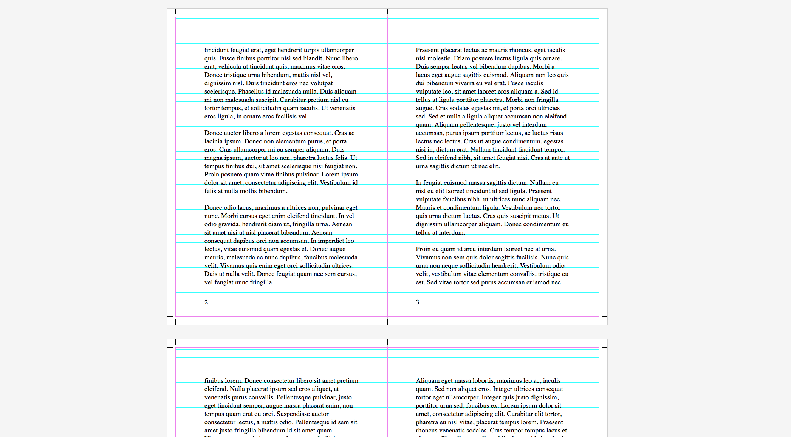

Interface for the polyfill
===========

Paged.js will manipulate the DOM so the browser can understand the css rules you wrote. On screen, pages will be shown from top to bottom on the left side of the page. To have a better understanding of what’s happening on the page, we made a small CSS file call interface that defines the layout to show your book on screen. Since we’re using @media screen, page borders and shadow won’t appear on paper when printed. 

Note that when the PDF is generated the pages are always in recto/verso, it'is not possible to lay out the pages on a plate.

## How to use it

Download the `interface.css` file and link the stylesheet to your document in the `<head>`: 

```<link href="path/to/file/interface.css" rel="stylesheet" type="text/css">```

Please check the file, as it already offers options to show facing pages, recto/verso, baseline, etc.
  
If you’re using paged.js prior to 0.4.1 you’ll want to use the `interface.legacy.css`

## Releases

### v0.3

- Add support for paged.js 0.4.1: add pagedjs-ignore so the whole style sheet is passed to the browser without being manipulated by paged.js
- move 0.2 to `pagedjs.legacy.css`


### v0.2

`git checkout 828b9865`

- Delete bleed inside for facing pages (on screen only)



### v0.1

`git checkout a1b3200e`

- Show facing pages or recto-verso (uncomment line of code for recto-verso)
- Show baseline (uncomment line of code)
- Show margin boxes (default: transparent)
- Variables to change the look


